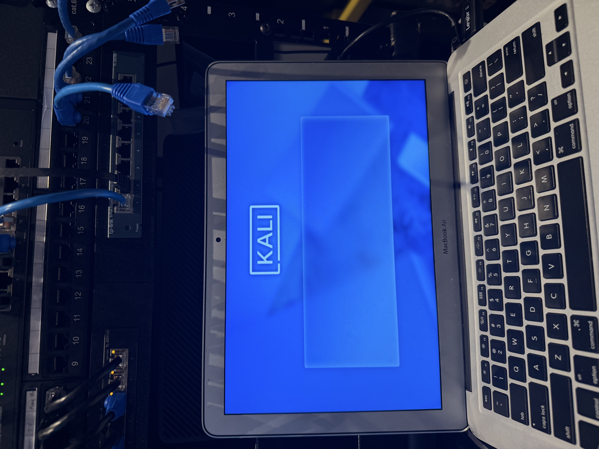
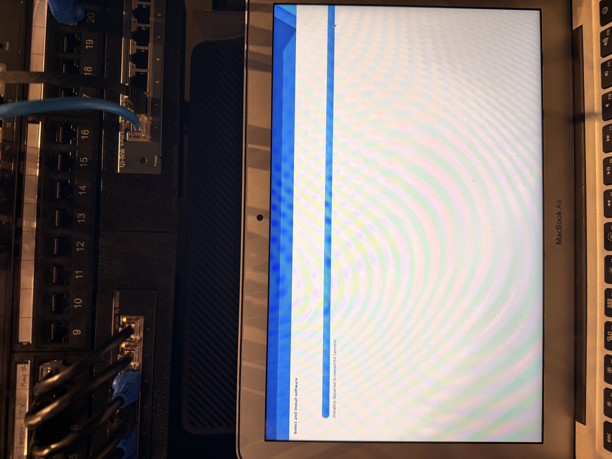
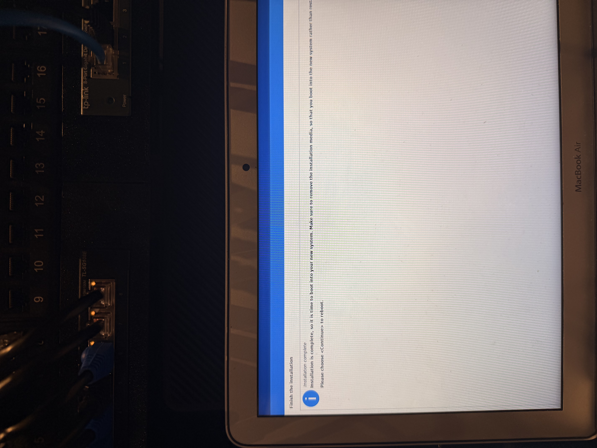
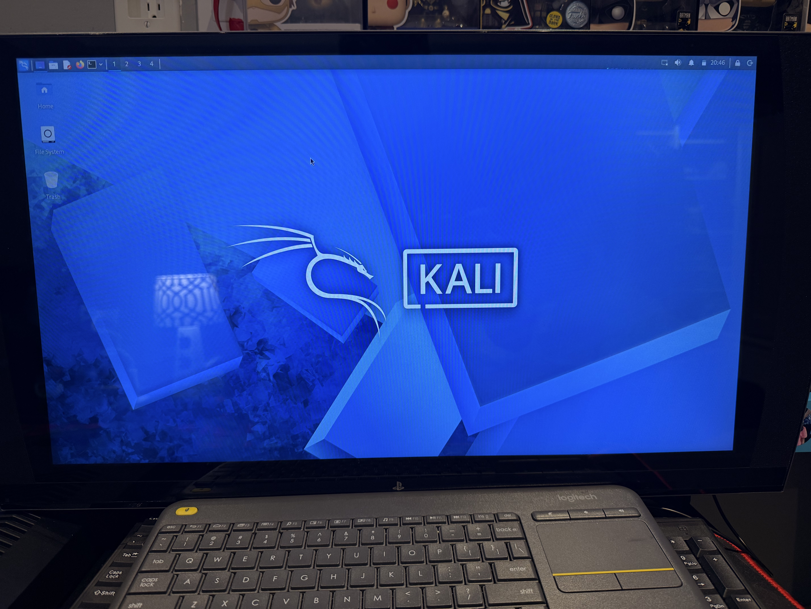

# Replacing Proxmox on My 2017 MacBook Air with Kali Linux

My i5-4690K build<sup>1</sup> was not compatible with Windows 11, and with Windows 10 reaching end of support, 
I replaced it with Proxmox, gaining access to 1TB of storage and a dedicated GPU. Rather than adding this MacBook Air as a cluster node,
I've chosen to repurpose it by installing Kali Linux to continue developing my cybersecurity experience.
---

## 1. Download the ISO and Verify Hash

I downloaded the installer image from the official Kali Linux site.<sup>2</sup>

The listed hash value of the ISO is: **Expected SHA256:** `271477ad6ea2676c7346576971b9acc2d32fabd9c2bbaf0e6302397626149306`

To compare the listed hash against the downloaded ISO, I ran the following to verify integrity before continuing:

```bash
HASH=$(shasum -a 256 ~/Downloads/kali-linux-2026.1-installer-amd64.iso | awk '{print $1}')
EXPECTED="271477ad6ea2676c7346576971b9acc2d32fabd9c2bbaf0e6302397626149306"
 
if [ "$HASH" = "$EXPECTED" ]; then
    echo "Hash verified"
else
    echo "Hash mismatch"
fi
```
**Output:** `Hash verified`

> I used `awk '{print $1}'` as it isolates just the hash from the `shasum` output, which is then compared against the expected value using a simple string equality check.


---

## 2. Flash the USB Drive

I identified my USB disk with:

```bash
diskutil list
```

I then unmounted it and flashed the ISO:

```bash
# Unmount all partitions on the disk
diskutil unmountDisk /dev/disk4
 
# Flash the ISO
sudo dd if=/Users/sebastiandorata/Downloads/kali-linux-2026.1-installer-amd64.iso \
     of=/dev/rdisk4 bs=4m conv=sync
```

To monitor progress, I ran the following in a **separate terminal window**:

```bash
sudo kill -INFO $(pgrep dd)
```
**Output:**
```
3468689408 bytes transferred in 184.661504 secs (18784042 bytes/sec)
1019+0 records in
1019+0 records out
```

---

## 3. Boot from the USB and Replace Proxmox with Kali

- On startup I held the Option key until I was presented with the startup manager.
- From there I followed the setup process, documented by the photos below:






---
## References

- <sup>1</sup> [Proxmox Setup](https://github.com/SebastianDorata/HomeLab/tree/c2574dda4d48bb8d0310e1922cd2d734af8f4043/Proxmox%20setup)
- <sup>2</sup> [kali.org — Installer Images](https://www.kali.org/get-kali/#kali-installer-images)
