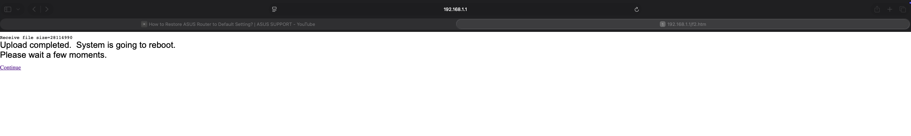
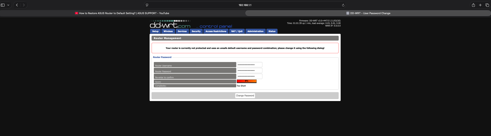

# <header style="display: flex; justify-content: center;">Asus RT-AC3200 DD-WRT Flash</header>
---

### <header style="display: flex; justify-content: center;">Table of Contents</header>

1. [Reset the router](#Step-1)
2. [Flash the Router](#Step-2)
3. [Security](#Step-3)
4. [Router Configuration](#Step-4)
5. [Why I started this project](#Step-5)

# Router reset 
---

1. Reset the router by holding the reset button on the back.1,2
   A) Turn off the router.
   B) Hold the WPS button and turn the router back on.
   C) Hold the WPS button until the power button flashes.
   D) Wait until the reset process is completed.

2. Connect my laptop to one of the LAN ports on the router
*I understand 5 instructs readers to use the WAN port, while I did not, I still included it as the thread was referenced*

3. Go to [Asus Router web](http://router.asus.com/) and reset the router again.  *As this was purchased second hand, I reset the router using both methods to reduce the likelihood of a supply chain attack*7

# Flash the Router

1. Download the trx file: v3.0 [Beta] Build  447153
   
2. On my laptop I set a static IP `192.168.0.10`, subnet mask `255.255.255.0`, and gateway `192.168.1.1`
   
3. Put the device in recovery mode.
   A) Unplug power adapter.
   B) Hold reset button and plug power adapter back in while holding the reset button.
   C) Keep hold reset until power led blinks slowly.

4. Go to the mini web server `192.168.1.1`

5. Upload the trx file and flash the router.

7. Go through the setup and reboot the router

Note: *Any users with Brave as their default browser and cannot access `192.168.1.1` should use Safari for this section*

Security
---
1. Change default credentials.
2. Disable http and enabled https under `Administration` then `Web Access`
3. Disable all remote access. [Please see the note in Router Configuration](#Step-3)

# Router Configuration
---
Note: *This documentation is for my personal use case. The following configurations may vary for those using this as a guide*

1. Disable DHCP.
2. Disable WAN.
3. Disable all radio bands. `wl0`, `wl1`, `wl2`.
4. Set a static IP within the range of my DHCP server, set the subnet mask and IP to that of my gateway.
5. Change mode from Gateway to Router and repeat step 4. `LAN NET` is the same as `gateway` and `metric` is `0` since there is only one route. Interface is `WAN/LAN` *Selected because `LAN` is not an option.*

---

# Why I started this project
---

Yesterday I went to Value village to look for some reference books on some projects I am currently working on. While I was there I stopped by the electronics section to see if there was any sff Dell OptiPlex, Lenovo ThinkCentre, HP elite desks or —if I’m really lucky—a Panasonic DP-UB150/UB154.

I stumbled upon the Asus RT-AC3200, a few of them actually. Because of the quantity and seeing they are EOL, I figured they were donated by a local business. With that, the price, and dd-wrt support I felt comfortable purchasing it

Use case, undecided. I am thinking of setting up a Radius server and PiHole. 

References
---
1https://www.asus.com/us/support/faq/1039074/
2https://www.asus.com/support/faq/1039077/
3https://dd-wrt.com/support/router-database/?model=RT-AC3200_-
4https://forum.dd-wrt.com/phpBB2/viewtopic.php?t=332387&highlight=rt-ac3200
5https://www.snbforums.com/threads/rt-ac3200-recovery-rescue-mode-ignore-bad-internet-instructions.97018/
6https://www.snbforums.com/threads/asus-rt-ac66u_b1-cant-get-into-rescue-mode.81757/
7https://www.professormesser.com/security-plus/sy0-701/sy0-701-video/supply-chain-vulnerabilities-sy0-701/
8[Product Documentation](E9670_RT-AC3200_Manual.pdf)

