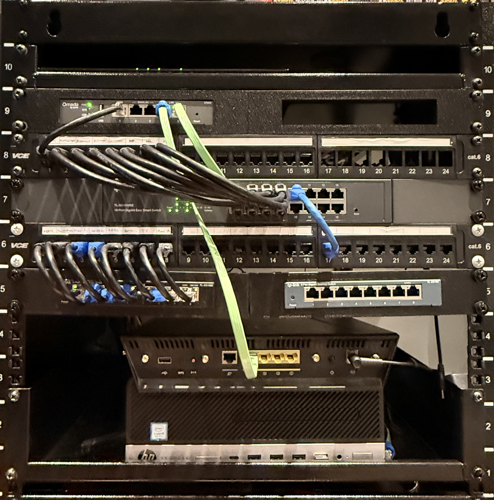

Network Attached Storage
---
|Hardware		| Firmware 	| Partition	|OS	 			|
|:-------------:|:---------:|:---------:|:-------------:|
| Asus RT-AC3200| DD-wrt	| N/A		| N/A 			|
| Sandisk 32GB	| N/A 		| FAT 32	| N/A 			|
| Any PC		| N/A		| N/A		| Windows		|


# Converting a USB Drive from OS Installer to Router-Attached NAS Storage

**Goal:** Take a USB drive previously flashed as a bootable OS installer (e.g. `dd`) and repurpose it as a plain data volume that DD-WRT can mount and share over Samba.

---

## 1. Why this isn't a simple reformat

 **no visible partition to reformat** through the normal right-click → Format in File Explorer, because the OS installer partition isn't the one Explorer shows

Because of this, a normal "Format" from File Explorer often fails, refuses to run, or only reformats one small leftover partition instead of the whole disk. `diskpart clean` is the reliable way to wipe all of that out.

---

## 2. Windows side: wipe and reformat with diskpart

Run these from an **elevated (Administrator) Command Prompt or PowerShell**.

### 2.1 Open diskpart

```
diskpart
```

### 2.2 List all disks and identify the USB drive

```
list disk
```

> Replace disk 1 with the actual name of your drive.

### 2.3 Select the correct disk

```
select disk 1
```

Expected output:
```
Disk 1 is now the selected disk.
```

### 2.4 Wipe all partitions and hidden data

```
clean
```

Expected output:
```
DiskPart succeeded in cleaning the disk.
```

This removes all partitions, including the hidden EFI/boot partitions left behind by the ISO-flashing tool, and zeroes out the partition table.

### 2.5 Set the partition style

DD-WRT's USB storage support generally expects a simple **MBR** disk with **FAT32** or **NTFS** (kernel module dependent — see Section 3). MBR is the safer default for router compatibility:

```
convert mbr
```

Expected output:
```
DiskPart successfully converted the selected disk to MBR format.
```

### 2.6 Create a new primary partition

```
create partition primary
```

Expected output:
```
DiskPart succeeded in creating the specified partition.
```

### 2.7 Format the partition

Pick **one** based on what DD-WRT build/kernel modules you have loaded (see 3.1):

```
format fs=fat32 quick label="NAS-USB"
```
or
```
format fs=ntfs quick label="NAS-USB"
```

Expected output:
```
100 percent completed

DiskPart successfully formatted the volume.
```

### 2.8 Assign a drive letter and exit

```
assign letter=X
exit
```

Expected output:
```
DiskPart successfully assigned the drive letter or mount point.
```

At this point the drive should appear in File Explorer as a normal, empty, properly-sized volume. Sanity-check the size matches the actual USB capacity — if it still shows small, `clean` didn't fully take; repeat Steps 2.2–2.5.

---

## 3. Router side: DD-WRT USB storage + Samba

### 3.1 Confirm USB storage support is enabled

`Services → USB` (or `Administration → Services` depending on DD-WRT build) — confirm these are checked:
- Core USB Support
- USB Storage Support
- Automatic Drive Mount
- Filesystem support matching what you formatted in 2.7 (FAT32 support is built into most DD-WRT builds; NTFS support requires the build to include `ntfs-3g`/`usbip`/full kernel modules — check `Status → USB` after mounting)

Reboot the router if you changed any of these.

### 3.2 Physically connect the drive

Plug the USB into the router's USB port. Then check:

`Status → USB` (or `Administration → Status → USB` depending on version)

Expected: the drive should appear listed with its device node (e.g. `/dev/sda1` or `/dev/discs/disc0/part1`) and mount point (typically `/mnt/<label>` or `/tmp/mnt/<label>`).

If it does **not** appear:
- Confirm filesystem type matches enabled kernel modules (Section 3.1)
- Check `Administration → Commands → Startup` isn't overriding mount behavior from a previous config
- Try re-seating the drive or power-cycling the router

### 3.3 Enable Samba sharing

`NAS → Samba` (or `Services → NAS` depending on DD-WRT build):
- Enable **Samba**
- **Share name**: pick something identifiable (e.g. `NAS-USB`)
- **Path**: point to the mount path confirmed in 3.2
- Set **Public** access or configure a Samba user under `NAS → Samba → Users` if you want authenticated access
- Apply, then reboot the router if the share doesn't show up immediately

### 3.4 Verify from a client machine

From Windows, in File Explorer address bar:
```
\\<router-IP>\<share-name>
```

From macOS/Linux:
```
smb://<router-IP>/<share-name>
```
> - On MacOS, Finder-> Go -> then enter above,
>- On IOS, Open the files app, then click the three dots in top right, then "Connect to server" and then enter above.

Expected: the share opens and is writable (test by creating/deleting a small file).

---

## 4. Troubleshooting notes

| Symptom | Likely cause | Fix |
|---|---|---|
| `diskpart` shows disk size far smaller than actual | Leftover ISO tool partition table / protected partition | Re-run `clean`, confirm with `list disk` again before creating a new partition |
| `format` fails with "The volume is too fragmented" or hangs | Bad blocks or partial clean | Re-run `clean`, try `convert gpt` instead of `mbr` if the drive is >32GB and giving FAT32 errors |
| Drive not detected by DD-WRT at all | USB storage support not enabled, or filesystem not supported by build | Check Section 3.1, confirm build has NTFS/FAT32 driver support (`Status → USB` should show a device even if unmounted) |
| Samba share unreachable from clients | Firmware needs reboot after enabling NAS/Samba, or share path doesn't match actual mount point | Re-check `Status → USB` for the real mount path, re-save `NAS → Samba` config |
| Windows shows drive as RAW after clean/format | Format step didn't complete or was interrupted | Repeat Steps 2.4–2.7 fully before assigning a letter |

---

Current (partial) state of my Homelab. 
>My PC running Proxmox is not shown in the photo.
	


### Future plans
I recently learned select [Toronto Public Library](https://tpl.ca/using-the-library/computer-services/digital-innovation-services/digital-innovation-hubs/) locations offer 3D printers for use. <br>
To clean up the rack, I am currently designing a mount for the router that will be placed to the right of the Omada ER605. <br>

The design tool I am using is Open SCAD.
For more information: https://openscad.org/downloads.html

[Homebrew](https://formulae.brew.sh/cask/openscad@snapshot) Installation:
```bash
https://formulae.brew.sh/cask/openscad@snapshot
```

Windows Installation (WinGet):

```bash
winget install --id=OpenSCAD.OpenSCAD -e
```

